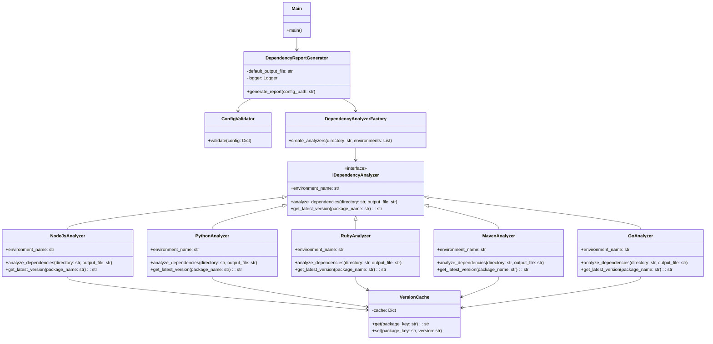

# Dependency Analyzer Architecture

This document describes the high-level architecture of the Dependency Analyzer tool, explaining its main components, workflow, and design patterns.

## Overview

The Dependency Analyzer is designed to be modular, extensible, and maintainable. It follows a component-based architecture that separates different concerns into distinct modules. This allows for easy addition of new programming language analyzers and makes the codebase more maintainable.

## Main Components

### 1. Core Components

#### Configuration and Validation (`core/config_validator.py`)
- Validates the user-provided configuration file
- Ensures all required fields are present and valid
- Verifies that paths exist and environments are supported

#### Factory (`core/factory.py`)
- Creates appropriate analyzer instances based on the environment type
- Checks for the existence of dependency files
- Manages shared resources (e.g., version cache)

#### Report Generator (`core/generator.py`)
- Orchestrates the overall analysis process
- Manages the generation of the Markdown report
- Handles errors from individual analyzers

#### Cache (`core/cache.py`)
- Provides caching for package versions to improve performance
- Persists cache to disk between runs

#### Logging (`core/logging.py`)
- Configures logging for the application
- Provides log file and console output

#### Exceptions (`core/exceptions.py`)
- Defines custom exception types for better error handling
- Provides utility functions like `run_command` for executing external processes

#### Constants (`core/constants.py`)
- Centralizes configuration constants
- Defines supported environments, dependency files, and API URLs

### 2. Analyzer Components

#### Interface (`analyzers/interface.py`)
- Defines the common interface all analyzers must implement
- Provides base functionality shared by all analyzers

#### Language-Specific Analyzers
- **Node.js Analyzer** (`analyzers/nodejs_analyzer.py`): Analyzes Node.js/npm projects
- **Python Analyzer** (`analyzers/python_analyzer.py`): Analyzes Python/pip projects 
- **Ruby Analyzer** (`analyzers/ruby_analyzer.py`): Analyzes Ruby/Bundler projects
- **Maven Analyzer** (`analyzers/maven_analyzer.py`): Analyzes Java/Maven projects
- **Go Analyzer** (`analyzers/go_analyzer.py`): Analyzes Go projects

Each analyzer is responsible for:
- Parsing dependency files specific to its environment
- Fetching the latest versions of dependencies
- Comparing current vs. latest versions
- Writing analysis results to the report file

### 3. Entry Point (`main.py`)
- Parses command-line arguments
- Sets up logging
- Initiates the report generation process

## Workflow

The dependency analyzer follows this workflow:

1. **Configuration**: The application reads and validates the configuration file
2. **Initialization**: The report generator is created and logging is set up
3. **Analysis Preparation**: For each directory in the configuration:
   - The factory creates appropriate analyzers based on the specified environments
   - Only analyzers with corresponding dependency files are created
4. **Analysis Execution**: For each created analyzer:
   - The analyzer parses the dependency file to extract current dependencies
   - It fetches latest versions from the appropriate package registry
   - It formats and writes its results to the report file
5. **Finalization**: The report generator adds a summary and completes the report

## Design Patterns

The dependency analyzer implements several design patterns to achieve a clean, maintainable, and extensible architecture:

### 1. Strategy Pattern
The analyzer implementations (`NodeJsAnalyzer`, `PythonAnalyzer`, etc.) follow the Strategy pattern. Each provides a different implementation of the common interface defined in `IDependencyAnalyzer`, allowing the system to support different dependency analysis strategies for different programming environments.

### 2. Factory Pattern
The `DependencyAnalyzerFactory` implements the Factory pattern to create analyzer instances dynamically based on the environment type and the presence of dependency files. This centralizes and encapsulates the creation logic and allows for easy addition of new analyzer types.

### 3. Facade Pattern
The `DependencyReportGenerator` uses the Facade pattern to provide a simplified interface to the complex subsystem of analyzers, factory, and report generation. It coordinates the interactions between components, hiding the complexity from the client (`main.py`).

### 4. Template Method Pattern
The `IDependencyAnalyzer` implements the Template Method pattern in its `analyze_dependencies` method, defining the skeleton of the analysis algorithm while allowing subclasses to override specific steps (`_parse_dependencies`, `_get_installed_dependencies_with_latest`, etc.).

### 5. Dependency Injection
The analyzer classes accept a `VersionCache` instance in their constructors, implementing a form of dependency injection that makes it easier to share the cache across analyzers and simplifies testing.

## Architecture Diagram

## Extensibility

The architecture is designed to be easily extensible in several ways:

1. **Adding New Analyzers**: New language analyzers can be added by implementing the `IDependencyAnalyzer` interface, adding the environment to the constants, and updating the factory.

2. **Enhanced Caching**: The cache system can be extended to support TTL (Time-To-Live) or more sophisticated caching strategies.

3. **Additional Report Formats**: The report generation could be extended to support different output formats (e.g., HTML, JSON) by adding new generator classes.

4. **Dependency Resolution**: The system could be extended to not just report on dependencies but also to update them or generate lockfiles.
